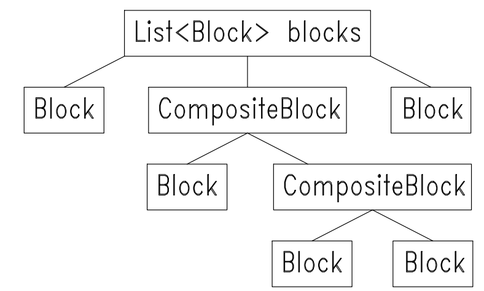

# Zadanie-rekrutacyjne
Celem zadania jest napisanie trzech funkcji:
```bash
    Optional<Block> findBlockByColor(String color);
```
zwraca dowolny element o zadanym kolorze,
```bash
    List<Block> findBlocksByMaterial(String material);
```
zwraca wszystkie elementy wykonane z danego materiału,
```bash
    int count();
```
zwraca liczbę elementów tworzących strukturę.
## Opis rozwiązania
W rozwiązaniu posłużono się wzorcem projektowym kompozyt. Interfejsem komponentu jest Block, kompozytem CompositeBlock, a klientem klasa Wall. Klasa Wall posiada jedno pole - List<Block> blocks.
Założono, że w tej liście mogą się znajdować zagnieżdżone CompositeBlocki, przykładową strukturę przedstawiono w poniższym punkcie. Rozwiązanie opiera się o metodę
```bash
private List<Block> getAllBlocks(List<Block> blocks)
```
w której następuje wyodrębnienie wszystkich elementów listy, aż będą się tam znajdować tylko Blocki. Metoda ta wykorzystuje rekurencję i zlecanie poniższym elementom wykonania zadań elementów nadrzędnych.
## Struktura zadania
Przykładowa zawartość listy Blocków z klasy Wall:

## Uruchomienie
będąc w folderze **/zadanie rekrutacyjne**
```bash
    javac Wall.java
    java Wall
```
